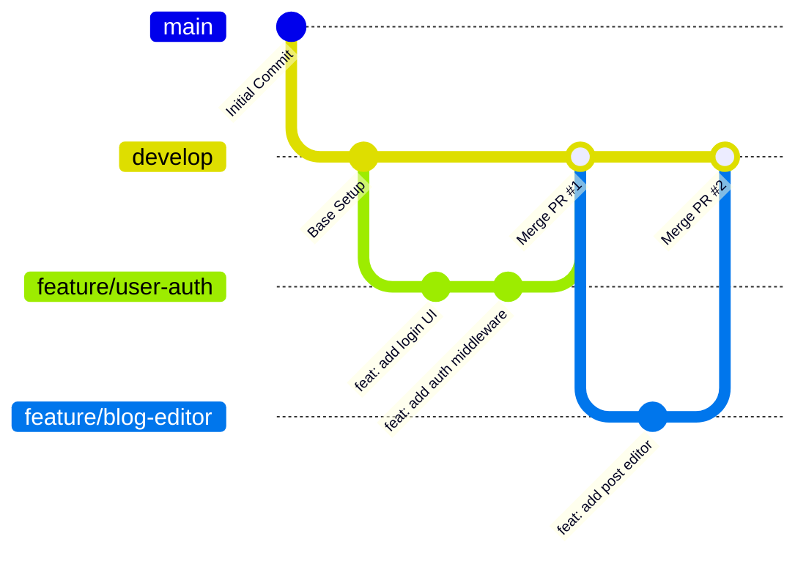

# Humana

A collaborative blog application built for team development.

---

## 🛠️ Installation & Setup Guide

This guide is for team members setting up the project repository locally.

### 1. Clone the Repository

Choose your preferred protocol (HTTPS or SSH) to clone the repository to your local machine:

#### Option A: HTTPS
```bash
git clone https://github.com/Abhinks151/Humana.git
cd Humana
```

#### Option B: SSH
```bash
git clone git@github.com:Abhinks151/Humana.git
cd Humana
```

### 2. Set Up Local Branch

Fetch remote branches and switch to the `develop` branch where active development takes place:

```bash
git fetch origin
git checkout develop
```

---

## 🔀 Git Flow Branching Strategy

Our team follows a feature-branch workflow off the `develop` branch to ensure clean code and seamless collaboration.

### Branch Conventions

- **`develop`**: Main integration branch. All feature branches originate from and merge back into `develop`.
- **`feature/*`**: Individual feature branches created for specific tasks (e.g., `feature/user-auth`, `feature/comment-system`).

---

### Workflow Flowchart



---

## 📝 Commit Message Rules (Conventional Commits)

We follow the [Conventional Commits](https://www.conventionalcommits.org/) specification to maintain clear, standardized, and readable commit logs.

### Format
```text
<type>(<scope>): <description>
```
*(Scope is optional)*

### Allowed Types

| Type | Description |
| :--- | :--- |
| **`feat`** | A new feature for the user |
| **`fix`** | A bug fix |
| **`docs`** | Documentation changes only |
| **`style`** | Code formatting, missing semi-colons, etc. (no code logic changes) |
| **`refactor`** | Refactoring code without changing functionality or fixing bugs |
| **`test`** | Adding or updating tests |
| **`chore`** | Updating build tasks, configurations, or tooling |

### Examples
```bash
git commit -m "feat(auth): add JWT authentication logic"
git commit -m "fix(blog): resolve pagination bug on post list"
git commit -m "docs: update team setup commands in README"
git commit -m "refactor(database): simplify user query helper"
```

---

## 🚀 Team Development Workflow (Commands Guide)

Follow these exact steps for developing features and submitting code to the repository.

### Step 1: Update Your Local `develop` Branch
Always pull the latest changes from `develop` before starting new work:

```bash
git checkout develop
git pull origin develop
```

### Step 2: Create a Feature Branch
Create a new feature branch off `develop` using a clear naming convention:

```bash
git checkout -b feature/your-feature-name
```

### Step 3: Commit Your Changes
Stage and commit your changes following Conventional Commits rules:

```bash
git add .
git commit -m "feat(blog): add rich text editor component"
```

### Step 4: Keep Branch Updated
If other team members merged code into `develop` while you were working, rebase your feature branch:

```bash
git fetch origin
git rebase origin/develop
```

### Step 5: Push Feature Branch to GitHub
Push your feature branch to the remote repository:

```bash
git push -u origin feature/your-feature-name
```

### Step 6: Create a Pull Request (PR)
1. Go to the GitHub repository: [https://github.com/Abhinks151/Humana](https://github.com/Abhinks151/Humana)
2. Click **New Pull Request**.
3. Set the base branch to **`develop`** and compare branch to **`feature/your-feature-name`**.
4. Request review from team members.

### Step 7: Post-Merge Cleanup
Once your PR is approved and merged into `develop`, delete your local feature branch and sync `develop`:

```bash
git checkout develop
git pull origin develop
git branch -d feature/your-feature-name
```

---

## 📋 Sample Pull Request Template

```markdown
### Description
Brief summary of what this PR does.

### Type of change
- [ ] Feature (`feat`)
- [ ] Fix (`fix`)
- [ ] Refactor / Chore

### Checklist
- [ ] Branch updated with `develop`
- [ ] Follows conventional commit rules
- [ ] Tested locally
```


